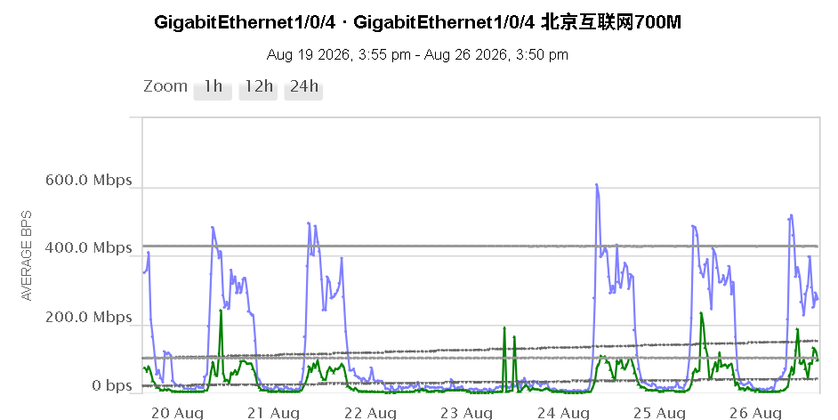
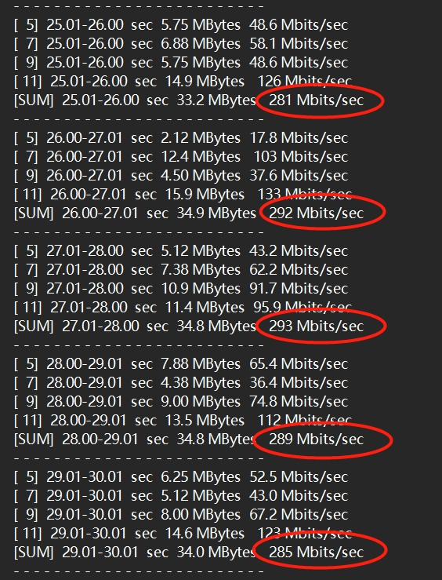

# 基础设施运维部网络安全组\-工作周报（2026/08/20\-2026/08/26\)   

# 一、整体运维状况

|## **本周运维数据汇总**|||||
|---|---|---|---|---|
|##### **组别**|##### 事件|##### **变更**|##### **演练**|##### **服务单**|
|### 网络|31|1|\-|\-|
|### 安全||3|1|1|
|### 本周**总计**|31|4|1|1|
|### 全年**总计**|1417|115|8|92|

# 二、重点事件回顾

|## 本周重点事件  |||||
|---|---|---|---|---|
|##### 时间|##### 内容|**等级**|##### 原因|##### 处理进度|
||||||
||||||
|## 未完成重点事件 |||||
||||||
||||||

# 三、重点网络设备和线路运行情况

|### **重点线路使用情况（****若有流量大幅提升或者下降注明****）**||
|---|---|
|##### 北京互联网出口 联通（700M） Max Receive bps 605Mbps Max Transmit bps 239Mbp  |燕郊互联网出口400M Max Receive bps 29Mbps Max Transmit bps 148Mbps   |
|##### SDWAN pop线路 （北京）300M（ 已撤销） |##### SDWAN pop线路 （燕郊）150M（42Mbps）  |
|##### 北京\-光子 移动300M Max Transmit bps 12Mbps  Max Received bps 38Mbps    |##### 北京\-光子 电信300M Max Transmit bps 67Mbps  Max Received bps 22Mbps    |
|F5 内网SSL TPS  MAX（1400）  |F5 DMZ SSL TPS  MAX（2780）  |

# 四、重点项目执行情况及进度

|**项目内容**|**进展**|**开始时间**|**计划完成时间**|**本周关键事项/成果**|**下周计划**|**责任人**|
|---|---|---|---|---|---|---|
|**燕郊机房机juniper交换机软件升级** |10%|2026/7/24|2026/12/30|- 通过NSSU升级A9机柜QFX51交换机 - 已完成2台，还剩18台，总共20台 - [A9\_QFX5100\_VC\_NSSU升级实施报告\_20260826\.docx](Images_attachments/A9_QFX5100_VC_NSSU升级实施报告_20260826.docx) - [Juniper\_QFX51在线设备升级计划](https://wanda.feishu.cn/sheets/UhBVsRnhjheawztybXDc6mEXnCc?from=from_copylink&sheet=1LlmKA) - [Juniper\_QFX51在线设备升级实施方案\.docx](Images_attachments/Juniper_QFX51在线设备升级实施方案.docx)|- D14存储备份机柜TOR QFX51进行升级 |@张良\-合作方\(v\_zhangliang\)|
|**F5配置清理**|1%|2026/7/30|2026/12/30|- 本周为月末月结，未做变更，释放：0 VS / 0 Pool - 需要释放的资源动态变化。截至今天，因新增一批 Pool 服务停止，需要释放的资源总量更新为 44 个 VS 虚拟服务、64 个 Pool - 动态总量：44 VS / 64 Pool     - 本周释放：0 VS / 0 Pool     - 累计已释放：29 VS / 29 Pool     - 剩余待释放：15 VS / 35 Pool - [F5配置清理变更计划\.xlsx](Images_attachments/F5配置清理变更计划.xlsx) - [F5配置清理方案\.docx](Images_attachments/F5配置清理方案.docx)|||
|**防火墙设备软件升级**|15% |2026/7/30|2026/11/30 |- 评估防火墙升级兼容性 - 建立升级计划表 - 已完成CP管理服务器，非生产区，北京互联网升级 [防火墙升级计划\-2027](https://wanda.feishu.cn/sheets/CnrWsZg8lhSRontjxp0cXj7Cnbf?sheet=9PxbfI)|- 升级北京外联区防火墙|@任建鑫\-合作方\(v\_renjianxin\)|
|**SDWAN节点 ipsec链路备份** |50% |2026/05/19 |2026/08/30|- 完成备份方案规划[珠海办公区IPSEC备份方案](https://wanda.feishu.cn/wiki/KS7CwNUqcir1zYkS2Njc1WJQnTd) - 已完成珠海办公区整体方案实施 - 测试天津财务共享中心备份方案完成|- 待天津确认备份意向|@任建鑫\-合作方\(v\_renjianxin\)|
|**网络安全应急演练** |50%|2026/2/27 |2026/12/16 |[2026网络安全应急演练计划](https://wanda.feishu.cn/sheets/Wz5ysJ2cZhX6mjtyofmcSDj6nyc?from=from_copylink)  - 本周完成北京互联网区网络安全设备故障应急演练   已完成8次演练  总共12次演练 - 数据中心互联网区网络设备单机故障应急演练 | - |@张良\-合作方\(v\_zhangliang\) @任建鑫\-合作方\(v\_renjianxin\) @陈红林\-合作方\(v\_chenhonglin3\)|
|**防火墙策略优化**|0%|2026/03/25|2026/12/31|- 收集部分待优化策略会话日志||@任建鑫\-合作方\(v\_renjianxin\)|

# 五、已完成项目

|**宝贝王新增专线**|40%|2026/7/30|待定|- B2机房布线完成 - 当前已完成生产网联通|- 待宝贝王沟通线路问题，恢复测试网|@陈红林\-合作方\(v\_chenhonglin3\) @任建鑫\-合作方\(v\_renjianxin\)||
|---|---|---|---|---|---|---|---|
|**CP防火墙替换**|100%|2026/05/10 |2026/08/05 |- 当前已完成北京互联网出口，燕郊互联网出口，北京PTN防火墙,珠海办公防火墙区，非生产区替换 | |@任建鑫\-合作方\(v\_renjianxin\)||
|**js\.wanda\.cn更新设备**|100%|2026/8/4|2026/8/6|- 已完成在线设备更新||@任建鑫\-合作方\(v\_renjianxin\)||
|**清理北京办公区各楼层无用静态绑定IP**|100%|2026/7/22|2026/8/7 |- B座23，25层有线,无线汇聚已清理 ||@陈红林\-合作方\(v\_chenhonglin3\)||
|**北京总部机房整合** |100% |2025/12/05  |2026/7/29 |- 资产表更新 ||@陈红林\-合作方\(v\_chenhonglin3\)||
|**IP地址规划表**|100%|2026/07/07|2026/7/22|- 增添北京数据中心IP信息||@陈红林\-合作方\(v\_chenhonglin3\)||
|**燕郊机房机柜迁移** |100%|2026/7/20|2026/7/27|- 资产更新 - 坏件入库 ||@张良\-合作方\(v\_zhangliang\)||
|**数据中心F5替换** |100%|2026/07/09|2026/07/22 |- 完成F5替换 |持续观察SSL TPS 性能指标 优化监控参数 |@张良\-合作方\(v\_zhangliang\)||
|**配合酒管迁移** |100%|2025/12/10 |2026/06/30|- 根据酒管提供的需求开通相应安全策略 - ~~分配相关设备互联ip~~ - ~~确定互联方案~~ - ~~待酒管提供设备到货配合调试~~ - ~~完成与同程机房互联外联区建设~~ |- 无 |||
|**北京核心网络优化方案** |100% |2025/09/18 |2026/5/20 |- 23层机房设备BJ\-BK\-CR3下线 - 清理核心无效配置 - 清理AC无效配置|  | ||
|**北京 ⇌ 燕郊 移动 ****/电信 ****300M专线建设** |100%|2026/05/07|2026/05/21|- 完成双300M线路对裸光纤的替换 - ~~完成 北京 ⇌ 燕郊 电信 300M 质量压测，测试结果如下：~~    **延迟与稳定性对比（Ping测试）** **新建电信300M专线（图一）：** 连续发送10000个数据包，**丢包率为 0%**。平均延迟为 **7\.336 ms**，最低延迟 4\.622 ms。 **同环境裸光纤（图二）：** 连续发送10000个数据包，**丢包率为 0%**。平均延迟为 **4\.939 ms**，最低延迟 2\.386 ms。 **对比分析：** 两条线路的整体稳定性都极佳（万次Ping测试零丢包）。**裸光纤的物理延迟表现更优**（平均延迟比专线低约 2\.4 ms），这符合裸光纤因减少中间路由转发节点而具备更低延迟的物理特性。不过，两者的最大延迟峰值（约85\-86ms）和网络抖动基本一致。 **带宽达标情况（图三）** **300M带宽测试：** 在多线程测速下，总计（SUM）吞吐量稳定维持在 **281 Mbits/sec 至 293 Mbits/sec** 之间。 **分析：** 考虑到实际网络传输中的协议栈开销（TCP/IP头部等正常损耗），实测速率达到 280\-290 Mbps 左右属于**完全达标且表现优秀**，证明该专线的带宽供给非常充足。 - 完成 北京 ⇌ 燕郊 移动300M 质量压测 测试结果如下：    **延迟与稳定性对比（Ping测试）** **新建移动300M专线（图一）：** 连续发送10000个数据包，**丢包率为 0%**。平均延迟为 **7\.347 ms**，最低延迟 **4\.545ms**。 **同环境裸光纤（图二）：** 连续发送10000个数据包，**丢包率为 0%**。平均延迟为 **4\.669 ms**，最低延迟 **2\.181ms**。 两条线路的整体稳定性都极佳（万次Ping测试零丢包）。 **带宽达标情况（图三）** **300M带宽测试：** **完全达标且表现优秀**，证明该专线的带宽供给非常充足。| - 删除裸光纤配置 |||
|**证书更新** |100%|2026/03/30 |2026/04/08|- ~~其他调用\*\.~~~~wanda\.cn~~~~ 证书的应用进行证书更新~~ ~~注意新的\*\.wanda\.cn会在10月份到期，这是SSL证书政策调整导致的。~~ - ~~www\.wandaplazas\.com 证书更新~~ - ~~solarwinds\.wanda\.cn证书更新~~ - ~~酒管vpn网关证书更新~~ - ~~集团vpn网关证书更新~~ |- 无 |||
|**燕郊IDC机房Juniper网络设备2026第一季度巡检**|100%|2026/03/26 |2026/04/01 |- 完成juniper设备巡检166台 [万达集团2026年3月Juniper设备巡检报告\(1\)\.pdf](Images_attachments/万达集团2026年3月Juniper设备巡检报告%281%29.pdf)||||
|**数据中心生产区整合**|100%|2025/12/05 |2026/03/19 |- ~~完成两区合并~~ - ~~完成生产区基本整合方案~~ - ~~完成综合布线~~ - ~~完成整体策略合并~~ | |||
|**项目名称**|**进展**|**完成时间**|**结果**|**相关事项**|**发现的问题/风险**|||
|**网络设备替换评估：**利用现有备件提升网络设备性能|100%|2026/1/22|2026/2/2 |- 更新设备替换清单：[设备替换](https://wanda.feishu.cn/sheets/NxfksUu9DhFmjRtfkBjcpREfnNh) |- 确定光子机房可替换设备的机柜|@党永义\-合作方\(v\_dangyongyi\) @张良\-合作方\(v\_zhangliang\)||
|**北京机房设备接口描述更新及互联关系梳理**|100% |2026/1/20|2026/2/4 |- B2、23层机房网络设备无用接口shutdown、描述已更新 - 更新机房设备接口互联表：[核心机房设备接口互联表\-20260203](https://wanda.feishu.cn/sheets/Z31Xsy376hpMxEtesEscNOcAnXe?from=from_copylink&sheet=tLogQK)||@党永义\-合作方\(v\_dangyongyi\)||
|**数据中心网络安全设备盘点**|100%|2026/1/20|2026/1/22 |本次盘点网络设备共341台，较上季度减少67台（报废处置64，3台设备运往北京备用），其中在线设备205台，较上季度减少30台，暂时作为备件，后续评估是否须处置||@任建鑫\-合作方\(v\_renjianxin\) @张良\-合作方\(v\_zhangliang\)||
|**数据中心非生产区整合**|100%|2025/01/21 || - 完成非生产区（网管，测试）区域整合，下线交换机两台，防火墙两台 - ~~Juniper集成商针对IDC设备进行巡检~~ - ~~完成网管区测试区策略合并~~ - ~~测试区布线完成，变更脚本完成~~ - ~~机柜资源梳理~~ - ~~非生产区域整合~~ ~~完成受影响设备列表~~ ~~完成合并布线信息~~ ~~完成拓扑图~~ ~~完成非生产区域整合方案~~ - ~~生产区域整合信息梳理及整合方案~~|-  |||
|**负载均衡设备资源整理：**释放负载均衡 TCP/UDP 端口资源，清理过期的 SSL 证书 |100% |2025/09/01 |2025/12/25 | - 完成对F5巡检 - [万达集团F5设备巡检报告v1\-20251225](https://wanda.feishu.cn/docx/P0ZTd8K57oaqULxhW8ocxwurnri?from=from_copylink) 结合现网i4600近30天，以该平台cpu、内存等相关参数利用率来看，在R5900平台上可以在部署一台同等规模i4600流量的的Tenant。 但现网R5900平台已有Tenant，且vCPU以分配到最大26，如要部署需要停掉正在运行的Tenant，重新分配资源，该操作有一定的分险，需做好相关备份，在变更窗口期间操作。 - ~~对现有负载均衡配置中的未使用端口进行检查，并及时释放空闲的 TCP/UDP 端口，以提高资源的利用效率，已经完成负载均衡TCP/UDP虚拟服务无效资源清理，共计释放568组虚拟服务资源（已完成虚拟服务资源释放），现在为各种业务提供345组虚拟负载均衡服务资源~~ - ~~清理DMZ 150个过期证书 和密钥~~ - ~~剩下一个过期证书配置SNI目前无法删除~~ - ~~无用pool配置清理完成~~ |- 跟进下一步F5合并事宜 - I46合并至R59 -  |@张良\-合作方\(v\_zhangliang\)||
|**北京CBD网络设备垃圾配置清理** |100%|2025/09/18|2025/12/31 |- 清除接入交换机无效接口\<BJB2\-R10\-3U\_PTN\-SVR\-SW3\&4\> **6个**；\<BJB2\-R12\-38U\_PTN\-SVR\-SW5\&6\> **16个**；\<BJB2\-R11\-4U\_S5500\-1\-SRV\> **26个**；\<BJB2\-R11\-2U\_S5500\-2\-SRV\> **29个**；\<BJ23\-B07\_13\-17U\_S9810\-IRF\-SRV\> **14个**；\<BJ23\-B08\_21U\_S5500\-1\-SRV\> **20个**；\<BJ23\-B07\_21U\_S5500\-2\-SRV\> **20个**。 - 标记路由器\<BJ23\-C01\_4\-23U\_CR4\>无效接口322个，OSPF无效区域103个 - ~~AC 无用SSID：visitor 、test相关垃圾配置清理，减少配置421行。~~ - ~~\<BJ\-ZB\-WX5540E\-1\>AC垃圾配置清理：已清理无用SSID 15个、清理无用WLAN\-ESS接口15个、清理已下线AP 99个。共计减少配置2658行。~~ - ~~清理radius服务器547个无用AC认证节点~~ - ~~清除VRF vip vpn\-instance~~ - ~~核心交换机\<BJ\-ZB\-CS\-IRF\>清除无效路由105条；无用接口配置（包括ae、vlanif）103个；无用VLAN 41个；无用ACL策略7条，共计减少配置667行。~~ - ~~核心交换机\<BJ\-BK\-CS\-IRF\>清除无效路由26条、无用接口配置（包括ae、vlanif）74个；无用VLAN32个；无用ACL策略6条，共计减少配置570行。~~||@党永义\-合作方\(v\_dangyongyi\) ||
|**负载均衡设备资源整理：**释放负载均衡 TCP/UDP 端口资源，清理过期的 SSL 证书 |100% |2025/09/01 |2025/12/25 | - 完成对F5巡检 - [万达集团F5设备巡检报告v1\-20251225](https://wanda.feishu.cn/docx/P0ZTd8K57oaqULxhW8ocxwurnri?from=from_copylink) 结合现网i4600近30天，以该平台cpu、内存等相关参数利用率来看，在R5900平台上可以在部署一台同等规模i4600流量的的Tenant。 但现网R5900平台已有Tenant，且vCPU以分配到最大26，如要部署需要停掉正在运行的Tenant，重新分配资源，该操作有一定的分险，需做好相关备份，在变更窗口期间操作。 - ~~对现有负载均衡配置中的未使用端口进行检查，并及时释放空闲的 TCP/UDP 端口，以提高资源的利用效率，已经完成负载均衡TCP/UDP虚拟服务无效资源清理，共计释放568组虚拟服务资源（已完成虚拟服务资源释放），现在为各种业务提供345组虚拟负载均衡服务资源~~ - ~~清理DMZ 150个过期证书 和密钥~~ - ~~剩下一个过期证书配置SNI目前无法删除~~ - ~~无用pool配置清理完成~~ |- 跟进下一步F5合并事宜 - I46合并至R59 -  |@张良\-合作方\(v\_zhangliang\)||
|**设备资产信息表更新** |100%|2025/12/22|2025/12/23|- 北京机房在线设备名更新 - 网络设备软件版本更新 - 网络设备用途更新||@党永义\-合作方\(v\_dangyongyi\) ||
|**PTN区下线整合**|100%|2025/12/15|2025/12/26|- vpn网关设备由PTN区迁移到互联网接入区 - PTN区交换机设备下线||||
|**思科vpn迁移：将思科vpn用户迁移到PA3410** |100%|2025/10/12 |2025/11/21|- ~~已经将思科vpn acl转换为PA防火墙策略~~ - ~~根据用户组授权完成~~ - ~~测试ios移动端完成~~ - ~~整理思科vpn现有acl，对已经失效的策略删除，当前已经删除608条~~ - ~~对思科vpn现有acl涉及ip，提供其对应系统名称供调研中进行参考~~ - 根据各业态提供的需求，开通vpn策略 - 处理VPN切换过程中用户遇到的问题 - 两台思科vpn均已离线 - 目前ptnvpn用户峰值为1400 基本与思科vpn峰值相同| - 处理VPN切换过程中用户遇到的问题 |@任建鑫\-合作方\(v\_renjianxin\) ||
|**VPN备机上线**|100% |2025/11/28 |2025/12/04|- 迁移vpn策略 - 实施备机接入方案 - 测试备机vpn连接功能||@任建鑫\-合作方\(v\_renjianxin\) ||
|北京CPE集群升级|100%|2025/11/28 |2025/12/03|- 确定升级方案 - 提前规划升级设备 - 升级完成|- 下线多余的CPE设备|@张良\-合作方\(v\_zhangliang\)||
|**商管外联区与腾讯云接入区合并**|100%|2025/10/25 |2025/11/28 |- 持续监控两区接入线路峰值带宽，以提供数据分析设备性能 - 完成合并方案|- 下架商管专区设备|@任建鑫\-合作方\(v\_renjianxin\) @张良\-合作方\(v\_zhangliang\)||
|**无专线SDWAN隧道切至光子机房** |100%|2025/10/15|2025/10/23|- 完成无专线44个节点的信息收集 - 已和酒店负责人沟通，等待酒店负责人确认变更时间||@张良\-合作方\(v\_zhangliang\)||
|**北京B2/23层机房无用设备下线** |100%|2025/11/12|2025/11/13 |- 确认设备无流量且不再使用后下线 - 下线B2机房BJ\-ZB\-S5500\-IRF（非B座无线网络汇聚SW） - 下线B2机房BJ\-ZB\-AC\-1\&2\(非B座无线网络AC\) - 下线B2机房wandaB2\(连接非B座无线网络交换机\) - 下线23层机房BJ\-BK\-DMZ\-SW1（23层DMZ区，已无服务器连接）||@党永义\-合作方\(v\_dangyongyi\)||
|**巡检报告故障排查：**对巡检报告中的问题项逐一检查、处理 |100% |2025/9/29 |2025/10/20 |- 14台设备配置未保存：已保存 - 12\#26F\-HJ\-1电源故障：已更换 - 三台设备系统时间偏差大：已配置NTP服务器 - 18、21、22、23、25层六台风扇故障设备已更换。 - 四台IRF设备LACP MAD检测配置已增加。 - BJ\-BK\-Azure\-R\-01\\BJ\-BK\-Azure\-R\-02 BGP邻居状态检查、垃圾配置已清除。 - 链路聚合成员接口未选中设备已查看：均为手动shutdown，无故障接口。 - BJ\-BK\-S9810\-IRF\-SRV，IRF单板卡部署配置检查，已配置BFD MAD，单板卡故障可规避脑裂，无需优化。||@党永义\-合作方\(v\_dangyongyi\) ||
|**安全等保：**检查相关设备安全管理合规性 |100%|2025/10/11 |2025/10/04 |- 根据等保要求检查现网环境是否符合 - 对不符合要求设备整改 - 配合等保方进行等保测评 - 复测完成|- 待测评方反馈是否有改进项|@任建鑫\-合作方\(v\_renjianxin\) ||
|**B2 DMZ区防火墙下线**|100%|2025/11/06 |2025/11/11|- 确认下线方案，迁移在防火墙上的dmz网关 - 实施防火墙下线||@任建鑫\-合作方\(v\_renjianxin\) @党永义\-合作方\(v\_dangyongyi\)||
|**北京商管外联区防火墙替换**|100%|2025/08/28 |2025/10/23 |- 完成替换方案编写 - 替换完成||@任建鑫\-合作方\(v\_renjianxin\) ||
|**核心设备对接日志平台**|100%|2025/09/23|2025/09/30|- 确认搬迁后核心设备是否按照要求将系统日志对接到日志平台，当前已确认：  大核心 pa管理平台 内网核心，防火墙 DMZ核心，防火墙 ||@任建鑫\-合作方\(v\_renjianxin\) ||
|**防火墙搬迁过程中产生的临时配置删除**|100%|2025/09/11 |2025/09/25|- cp管理平台将临时配置及下线设备配置删除完成 - PA管理平台临时配置部分清理|- 继续PA管理平台临时配置清理|@任建鑫\-合作方\(v\_renjianxin\) ||
|**光子IDC数据中心盘点：**对机房网络设备与库房网络设备以及配件进行盘点。|100%|2025/09/17 |2025/10/21|- 对库房网络设备盘点已完成 - 对机房网络设备盘点已完成 - 对库房配件进行盘点 | |@郑松\(o\_zhengsong\) @张良\-合作方\(v\_zhangliang\) ||
|**光子IDC数据核心交换机板卡扩容：**针对EX9214进行业务板卡扩容 |100%|2025/10/10|2025/10/13|- 完成4\*EX9200\-32XS扩容 - 完成2\*EX9200\-12QS扩容 - 完成2\*EX9200\-40XS扩容 - 完成剩余槽位资源统计，内网区共计剩余可用槽位4个|- 无 |@张良\-合作方\(v\_zhangliang\)||
|**数据中心DMZ区防火墙替换** |100%|2025/08/28|2025/09/17|- 实施方案编写，完善中 - 替换完成||@任建鑫\-合作方\(v\_renjianxin\) ||
|**访问源限制合规检查：**搬迁期间临时放开的设备登录源地址限制，应依据规范重新收紧配置； |100% |2025/08/28|2025/09/17 |- F5已完成安全加固 - 防火墙已完成 - DMZ区汇聚交换机已完成 - 测试区汇聚交换机已完成 - 核心区交换机已完成 - test区汇聚交换机已完成 - 内网区核心交换机已完成 - 互联网汇聚交换机已完成 - 网管区汇聚交换机已完成 - ptn区汇聚交换机已完成||@郑松\(o\_zhengsong\) ||
|**堡垒机受管设备更新**|100%|2025/09/16 |2025/09/24 |- 更新当前数据中心设备 - 完善设备登录方式 - 删除已确认下线设备||@任建鑫\-合作方\(v\_renjianxin\) ||
|**网管监控优化检查：**全面梳理现有监控节点，精简冗余监控项，优化监控等级配置，提升监控效率和告警精准度。|100%|2025/08/28 |2025/09/22 |- 已完成全部在线设备的监控优化与完善，共计1820个监控单元，467个监控节点，端口1353个 - 监控结构调整：对原有的监控框架进行了结构性的重组，使其更加清晰和高效，确保关键区域的监控能够覆盖到位 - 重新分类：将不同的监控项目进行了重新分类，按重要性、区域性、设备类型等多个维度进行划分，使得各类监控任务能够更加精细化管理 - 优化层级：调整了监控的层级结构，合理安排了各级监控节点的职能和权限，以便更快速地定位问题并采取响应措施 - 重点线路带宽阈值报警：为确保网络稳定性，设置关键线路的带宽阈值报警。当带宽使用接近或超过设定阈值时，系统会自动触发报警，及时提醒网络管理员采取措施，防止网络拥堵或服务中断。 - CPU和内存阈值报警：针对服务器和设备的CPU与内存使用情况，设定合理的阈值报警。一旦CPU或内存的使用率超过预定限度，系统将发出预警，帮助管理员及时优化资源使用，避免性能瓶颈或系统崩溃。 - 为了降低无效告警频率、提升监控精准度，计划对平台的通用阈值配置进行调整，优化Warning（警告）和Critical（严重）级别的触发条件 - 计划对SolarWinds平台中两台Polling Engine的监控单元分配进行优化。目前两台设备监控负载严重不均衡：主用引擎（Primary）监控单元数为654，而备用引擎（Additional）为1164。为提升系统整体性能和资源利用率，计划将其重新分配，调整至两台各监控约909个单元，以实现负载均衡。|-   |@张良\-合作方\(v\_zhangliang\) ||
|**IDC机房核心网络机柜线缆整理：**对核心网络机柜中的所有线缆进行全面整理和规范化，确保线缆布局整齐，标识清晰，避免线缆缠绕和交叉，提升机房的可维护性和安全性。|100%|2025/09/09 |2025/09/15|- 对各个机柜的网络中断进行详细评估，分析影响范围，确保能够快速定位问题并采取相应措施 - 对需整改的线缆进行详细梳理，明确每条线缆的具体信息 - 天眼漏扫相关线缆已完成整改 - 已拆除无用线缆 - 所有网络机柜整理完毕||@郑松\(o\_zhengsong\) ||
|**网络运维文档整理** |100%|2025/09/01|2025/09/05 已完成 |- 文档梳理与核对：全面复核了涉及搬迁的网络拓扑、IP地址表、端口连接表、VLAN规划表、裸光纤连接表、设备资产清单等文档，标识需更新的关键信息。||||
|**跳板机使用合规检查：**搬迁完成后应停用应急跳板机，统一通过堡垒机（js）进行访问；|100%|2025/08/28|2025/09/03 |- 删除应急跳板机，供方登录权限 ||@任建鑫\-合作方\(v\_renjianxin\) ||
|**北京机房设备上架图及空间评估**|100%|2025/08/28|2025/09/05  已完成|- 23层及B2机房设备上架图更新以及空间评估完成||||
|**数据中心PTN区防火墙替换及整体区域建设**|100%|2025/08/28|2025/09/09|- 实施方案编写，完善中 - 计划下周二晚完成替换及区域建设 - 区域建设整体完成||@任建鑫\-合作方\(v\_renjianxin\) ||
|**AAA与登录策略安全检查：**确保仅在AAA服务器不可达时允许本地账号SSH登录，且禁止root用户直接SSH登录；（北京及集团专网）|100%|2025/08/28 |2025/09/03  已完成 |- 已完成北京及集团专网124台设备的登录策略安全检查 ||||
|**IDC设备垃圾配置清理：**清理搬迁过程中产生的无效配置，如冗余路由等，需逐一排查并清除； |100%|2025/08/28 |2025/09/10  已完成 |- 清理38条核心静态路由配置 - 清理70条路由策略，提升转发性能 - 清理250条前缀列表路由规则，提升策略匹配效率 - 清理48条class\-of\-service服务分类策略。 |-  |||
|**IDC接入交换机配置核查：**|100% |2025/09/02|2025/09/05  已完成|- 完成168台tor交换机配置信息核查||||
|**AAA与登录策略安全检查：**确保仅在AAA服务器不可达时允许本地账号SSH登录，且禁止root用户直接SSH登录；（数据中心）|100%|2025/08/28|2025/09/08  已完成 |- 已完成数据中心201台设备的登录策略安全检查 |- |||
|**本地账号密码修改：修改**root和lab用户密码复杂度；（数据中心）|100%|2025/08/28|2025/09/08  已完成 |- 已完成数据中心201台密码修改||||
|DMZ区A10配置迁移至新F5 互联网出口替换A10 |100%|2025/08/15 |- 已完成|[DMZ A10 topo\.ppt](https://wanda.feishu.cn/file/Hzh5bfdw6oAylPxz9wYcxg65n6d?from=from_copylink)  ~~设备上架，组建HA，升级版本，导入现网配置~~ ~~核对优化配置，解决无法完全同步配置问题~~ ~~完成互联网链路负载替换~~ ~~完成DMZ区F5替换~~ 迁移A10配置至F5 4600|[A10替换计划](https://wanda.feishu.cn/sheets/DKiBsCQGqhggwTtGnHdcyHI3n0f?from=from_copylink) [DMZ区负载均衡替换和整合](https://wanda.feishu.cn/docx/O7E4dZXQmomaM4xoaYfcdI8Anzb?from=from_copylink) [DMZ区负载均衡替换和整合](https://wanda.feishu.cn/docx/Btfvd0Dzio7FhGxexZ8ch0pznAN?from=from_copylink)  |~~抢占模式取消~~ ~~路由模式修改为等价模式~~ ~~迁移至F5之后存在路由转发异常~~ ~~切换后存在ARP更新异常，原厂建议更改实体IP~~ 邮件服务异常，其余问题均解决||
|万达电影数据中心网络搬迁|100%|2025/06/06|2025/06/16|- 讨论方案|- 编写方案以及变更脚本|||
|**数据中心Juniper设备2024第一季度巡检**|100%|2024/03/22 |- 已完成 |- ~~检查数据中心515台Juniper设备运行情况~~ - ~~备份所有设备配置~~|内网区EX92 1号板卡异常 |||
|数据中心迁移改造 【0批次迁移】 |100% |2025/03/10 |- 已完成|- 更新迁移资产信息 - 细化网络迁移方案 - 第0批次设备预配置 - 测试区F5 2000配置完成 - 测试区汇聚交换机配置完成 - 测试区防火墙配置完成 - 网管区汇聚配置完成  | - 第一批次迁移   |||
|数据中心公网地址释放 |100%|2024/09/09 |- 已完成|公网地址共使用317个，已释放103个， 本周释放0个，  |等待业务部门确认 |注：ping不通的互连内网IP ||
|数据中心迁移改造 【配置优化】 |100%|2025/03/28|- 已完成 |- ~~核心区~~ [核心区配置优化](https://wanda.feishu.cn/docx/Ouw7d1onroaB0lxWGsYcLFy4nbg) - ~~内网区~~ [内网区核心配置优化](https://wanda.feishu.cn/docx/JJ3wdX4fVo7TWqxeb3Wc5OYrnoc) - ~~MGT区~~ [MGT区核心配置优化  ](https://wanda.feishu.cn/docx/DX5edYCUVojZ5hxH6Svcf9DZnMb) - ~~TEST区~~ [TEST区核心配置优化   ](https://wanda.feishu.cn/docx/O55QdhTxloK3P3xugGncILwGn4d) - ~~CRE区~~ [CRE区核心配置优化](https://wanda.feishu.cn/docx/BQFmdKhxhoQIjWxDpq9ckM4Fnmb) - ~~PTN区~~ [PTN区核心配置优化 ](https://wanda.feishu.cn/docx/DjxWdP763oEFhbxgT9hchyqznwh) - ~~文旅区~~ [文旅区核心配置优化](https://wanda.feishu.cn/docx/XlIndyX8EojjZ0xzkaQcBO94n8e) - ~~数服区~~ [数服区核心配置优化](https://wanda.feishu.cn/docx/Z3tRd7So6o0iFrxf3WpcOyRlnEc)|~~状态down的端口会影响irb端口的ospf临接状态~~ |||
|数据中心迁移改造 【文旅区改造】|100%|2025/03/20|- 已完成 |- 文旅区改造方案完成 - 防火墙交换机负载均衡预配置完成 - 信息核对变更时间确认 - 综合布线完成 - 文旅区改造完成 - 下线文旅区网络设备，更新资源信息 |-  |||
|数据中心迁移改造 【VPN改造】|100% |2025/02/27|- 已完成|- 完成ASA迁移至INT区方案规划[廊坊asa5585迁移方案\_20230908](https://wanda.feishu.cn/docx/YrZTdKEryo9PjGxqluwcejwqnOV) - ASA迁移至INT区||||
|**网管系统SolarWinds建设项目** |100%|2024/03/15 |- 已完成 |- ~~完善新功能~~ - ~~制作报表~~ - ~~优化机器性能~~ - ~~优化告警机制~~ - ~~优化图表报告展示~~ - ~~升级2024\.1最新版本~~ |- ~~访问web服务速度有所提升，但还未到达满意程度，后续考虑提升数据库磁盘读写能力~~ |||
|**数据中心****负载均衡** |100%|2024/03/05|- 已完成   |- ~~清理过期证书~~ - ~~Disable 新~~~~OA~~~~相关无用的VS~~ - ~~测试A10 TH930 P4版本 Chrome 是否SSL报错：~~ - ~~内网F5设备完成替换~~ - ~~测试区新部署一台BIGIP5000作为证书测试环境：~~     - ~~初始化配置~~     - ~~将I7000配置写入5000S~~     - ~~DMZ 备机BIGIP5000配置完成~~ - ~~DMZ 备机A10 TH930 升级为P4版本：~~ - ~~测试区新增TH930作为SSL加速中转~~ - ~~DMZ区优化TH1030 SSL加密算法~~ - ~~检查所有F5安全漏洞隐患并加固安全防护机制~~ |~~重点关注EXPIRED\_CERTIFICATE\_IN\_USE状态的证书是否能删除~~ |||
|**新版****OA****上线**|100%|2023/10/20 2024/01/25 |- 2023/10/20完成正式生产网络环境 - 2024/01/25优化OA测试开发网络环境 |- ~~配合OA上线相关配置：~~     - ~~完成F5新建VS~~     - ~~完成防火墙相关端口开通~~ - ~~配合OA压力测试：~~     - ~~配合完成压测~~     - ~~监测F5性能图表 max ssl tps 3000左右，性能无压力~~ - ~~商讨iRules \(25层领导\)该策略的测试方案~~ - ~~F5新增15个node~~ - ~~oa11\-25，按域名分配到对应的pool~~ - ~~测试开发区新增A10 TH930作为OA专项负载均衡测试设备~~ |~~由于~~~~压测~~~~环境客户端IP过少导致真实服务器负载分担不均，临时将会话保持“~~[~~oa\_source\_addr~~](https://10.199.114.230/tmui/Control/jspmap/tmui/locallb/profile/persistence/properties.jsp?name=/Common/oa_source_addr)~~”改为“~~~~cookie~~~~”模式~~ **~~10月20号18点将~~****~~cookie~~****~~改回~~**[**~~oa\_source\_addr~~**](https://10.199.114.230/tmui/Control/jspmap/tmui/locallb/profile/persistence/properties.jsp?name=/Common/oa_source_addr) ~~slb http 模板 替代aflex~~ |||
|**廊坊数据中心机房新机柜网络设备启用**|100% |1. 2023/09/11 2. 2023/10/24 3. 2024/01/26 |- 已完成。 |1. ~~廊坊数据中心D机房，启用D4\-04、D4\-05、D4\-06机柜~~ 2. ~~廊坊数据中心D机房，启用D5\-11机柜~~ 3. ~~廊坊数据中心D机房，启用D5\-09、D5\-10机柜~~||||
|**思科vpn证书更新** |100%|2024/03/20|- 已完成|- ~~需要将新证书转换为pk12格式证书~~ - ~~使用ASDM平台上传证书并验证可用性~~ - ~~对ssl证书替换，并登录测试~~ |~~软件ASDM 需要特点版本的JAVA~~ ~~OpenSSL转换P12格式证书错误~~|||
|**ptnvpn证书更新**|100%|2024/03/20 |- 已完成|- ~~上传ssl证书到PTNvpn设备~~ - ~~查看上传后证书的到期时间~~ - ~~更换vpn网关及门户证书~~ - ~~验证证书对客户端兼容性~~||||
|**北京思科vpn更换联通1G地址**|100% |2024/01/23|- 已完成 |- ~~将新线路分配的地址111\.203\.158\.60送报运营商备案~~ - ~~备案完成后将新地址配置到vpn1设备~~ - ~~进行单机hosts测试联通性~~ - ~~将vpn1\.wanda\.cn的域名解析指到111\.203\.158\.60~~||||
|**PA管理平台M100替换** |100% |2023/10/30|- 已完成 |- ~~加电进行基础配置~~ - ~~正式替换并观察记录运行情况~~  ||||
|**Panorama证书更新** |100% |2024/03/15|- 已完成|- ~~根据官方通告，需要在4月前完成动态更新8794\-8485 或更⾼版，并重启防火墙及panorama~~|~~内网防火墙及Panaroma重启~~|||
|**宝贝王互联网业务迁移SDWAN改造**|100%|2023/10/27|- 已完成|- ~~共实施全国宝贝王门店248家~~||||
|**天津财务办公区网络巡检**|100% |1. 2023/11/3 2. 2024/2/1 |- 已完成 |- ~~整理天津财务共享中心、天津商管财务办公区和院线财务办公区所有网络设备远程登录信息和对应设备型号、序列号清单，提供给天津财务信息同事~~||||
|**非万院线交换机SDWAN实施添加临时本地账号**|100%|2023/11/15|- 已完成 |- ~~完成~~**~~236~~**~~家店网络设备本地账号~~||||
|**集团总部网络设备集成商巡检第一次季度巡检**|100%|2024/1/12|- 已完成|- 计划巡检总部所有集成商保网络设备，已全部完成||||
|**万达16路软件迁移** |100% |2023/11/3 |- 已完成|- 根据商管提供的全国广场硬盘录像机统计表，增加服务器访问公网策略，预计总调整489家广场，目前已全部完成|~~须在互联网路由器上关闭SIP协议~~ |||
|**裸光纤中断演练** |100%|2023/11/8|- 已完成 |- ~~整理集团总部裸光纤中断演练方案~~ - ~~评估演练过程中网络中断影响~~ - ~~进行集团裸光纤中断演练~~ - ~~通过演练发现3处断网隐患~~ - ~~变更调整裸光纤相关配置，保证冗余性~~ |- ~~B2机房一芯裸光纤线路丢包率5%\-12%，目前已shutdown该接口，待运营商排查原因；~~ - ~~当裸光纤全部恢复后，将主CPE从廊坊切回北京，耗时过长，本次共用30分钟；~~ - ~~当裸光纤全部中断后，北京总部和廊坊数据中心访问腾讯云正常，各地门店访问腾讯云都不通；且各地门店访问北京总部核心交换机上的部分IP地址通，另一部分不通。（其中包含影响认证服务器段访问）~~|||
|**华为防火墙添加网管测试项目**|100%|2023/11/28|- 已完成 |- ~~将五棵松万达广场防火墙添加至集团网管平台，测试各项指标显示信息是否正常~~ |- 华为防火墙不能同步设备信息到网管平台，需手工添加设备OID，目前可显示CPU和内存信息 - 存在问题：每新增一台防火墙，则需后台手工调用一次OID，操作较繁琐|||
|**非万院线专线撤销11月13至16日** |100% |2023/11/16|- 已完成|~~23家非万影城专线撤销~~ - ~~计划~~     - ~~根据院线SDWAN改造后协商专线是否使用情况决定~~ - ~~收到影城OA流程后提交专网撤销流程至运营商~~     - ~~本周23家非万影城专线撤销~~ ||||
|**非万院线专线撤销11月20至24日** |100% |2023/11/24 |- 已完成 |~~30家非万影城专线撤销~~ - ~~计划~~     - ~~根据院线SDWAN改造后协商专线是否使用情况决定~~ - ~~收到影城OA流程后提交专网撤销流程至运营商~~     - ~~本周30家非万影城专线撤销~~ ||||
|**CP防火墙集中管理平台替换** |100%|2023/12/10|- 已完成 |- ~~计划~~     - ~~在12月15日前完成替换~~ - ~~与厂商沟通替换流程~~ - ~~制定完整的替换方案~~||||
|**北京电信出口防火墙替换**|100%|2024/1/19|- 已完成|- 梳理PBR中的路由 - 将原pa品牌防火墙策略手动添加到cp防火墙管理平台 - 针对原有的线路故障自动切换逻辑进行跨平台翻译 - 替换故障设备||||
|**SDWAN平台策略梳理**|100%|2023/12/20|- 已完成 |- ~~梳理商管业务优先级流量走向策略~~ - ~~梳理影城业务优先级流量走向策略~~ - ~~梳理酒管业务优先级流量走向策略~~||||
|**万达广场专线降速** |100% |2023/12/25|- 已完成     - |- 57家万达广场专线降速 - 在12月31日前完成专线降速 |- 邮件已邮件发至运营商客户经理|||
|**非万院线专线撤销12月11至15日** |100% |2023/11/15 |- 已完成|27家非万影城专线撤销 - 计划     - 根据院线SDWAN改造后协商专线是否使用情况决定 - 收到影城OA流程后提交专网撤销流程至运营商     - 本周27家非万影城专线撤销 ||||
|**清理10号楼21层办公区退租配置及下架设备**|100%|2023/12/21|- 已完成 |- 清理10号楼21层办公区退租配置及下架设备||||
|**调整总部办公楼层互联网出口**|100%|2024/03/14|- 已完成|- 调整总部办公楼层互联网出口至移动出口||||
|**12号楼20层新开商管办公区网络调试**|100%|2024/01/11|- 已完成|- 12号楼20层新开商管办公区网络调试||||
|**珠海酒管话务中心新建办公区网络部署**|100% |2024/02/18|- 已完成|- 调试珠海酒管话务中心有线网络和无线网络 ||||
|**北京互联网出口链路变更**|100%|2024/01/17 |- 已完成 |- 北京互联网出口原移动600M链路替换为联通800M||||
|##### 安全合规建设 |100% |2024/01/10|- 已终止 |- ~~日志平台 ~~     - ~~规范化F5及思科认证日志完成~~     - ~~制作可视化面板~~ - ~~等保测评自查~~     - ~~配合填报等保自查项~~| 设备性能不足，接收log后崩溃 负载均衡类型设备范化标准待研发 无限期搁置|||
|**更换数服区防火墙硬盘**|100%|2024/03/10|- 已完成|- 更换并验证是否解决开机慢的问题||||
|**珠海商管16层新增办公区网络部署** |100% |2024/03/1|- 已完成 |- 梳理16层办公区交接的所有设备和线路 - 规划新业务和办公网段 - 规划无线点位图 - 规划网络拓扑图 - 调试所有网络设备||||
|**北京总部VPN实例优化**|100%|2024/03/05|- 已完成 |- 针对12号楼15层、12号楼26层、12号楼27层、B座B2层慧云机房网络进行VRF优化 - 针对B座4层、北京VPN、WANDA\-IH、传媒大屏网络进行VRF优化||||
|**非万院线SDWAN改造** |100% |2024/03/11|- 已完成|- 实施安排     - 总计需改造239家非万影城SDWAN网络，目前已完成231家。剩余8家专线未到期，需到期后单独实施||||
|**西安寰映影城宜家荟聚店影城专网设备网络调试**|100% |2024/3/29 |- 已完成 |- 西安寰映影城宜家荟聚店影城专网网络调试||||
|**协助测试万信更新流量走向调整**|100%|2024/3/28|- 已完成|- 选择50多家试点测试按部门推送更新流量可以走本地互联网，对比前后流量变化符合预期||||
|**院线总部办公区新建网络工作筹备**|100% |2024/3/31 |- 已完成|- 和院线总部新办公区现场网络联调 - 协助解决深信服dot1x认证对接AD域问题||||
|**集团内网接入腾讯云网络** |100%|2024/4/2|- 已完成 |- 调试腾讯云商管独立组网路由器和交换机 - 指导机房组接线 - 协助腾讯云解决BGP邻居无法建立问题 - 协助腾讯云处理业务不通问题。最终确定原因为腾讯云侧安全组策略未放行||||
|**院线DMZ区防火墙替换**|100%|2024/04/17|- 已完成 |- 将院线dmz区cp4800防火墙替换为新采购cp6600设备||||
|**B座11层新办公区网络部署**|100%|2024/4/15 |- 已完成 |- 协商网络部署方案 - 指导集成商安装AP位置 - 指导集成商替换POE设备及连线 - 调试11层无线网络 - 测试11层无线业务访问均正常 - 拆除11层原来所有AP|- 经协商拆除B座11层原有4系列型号AP，全部换为12号楼在用的6系列型号AP|||
|**商管腾讯云独立组网裸光纤链路网络部署** |100%|2024/4/15|- 已完成|- 协商BGP参数 - 配置基于裸光纤链路的生产通道和测试通道 - 处理此网络到廊坊数据中心路由异常问题，已过滤通过BGP从腾讯云网络学到的除业务段和互联段外的其他路由||||
|**珠海万采创业园办公区网络建设** |100%|2024/4/24 |- 已完成|- 联调网络 - 解决无线无法认证问题 - 解决有线认证异常问题 - 更新拓扑图 - 添加网管设备||||
|**总部商管办公区流向过墙安全控制** |100%|2024/5/11|- 已完成|- 已整理完成配置方案||||
|**12号楼26层上联光纤及配置迁移**|100% |2024/5/8|- 已完成|- 梳理因12号楼27层搬家导致26层断网原因 - 整理上联光纤迁移方案 - 指导施工方迁移光纤配线架和线缆 - 调试12号楼26层网络||||
|**六安霍邱万达广场专网设备网络调试**|100% |2024/5/7|- 已完成|- 六安霍邱万达广场专网网络调试 ||||
|**B座5层商管部分区域无线开会卡顿问题**|100%|2024/5/7|- 已完成|- 更换5层卡顿区域故障AP - 开会卡顿问题已解决||||
|**集团跳板机下线** |100%|2024/5/10|- 已完成 |- 集团跳板机根据需求下线 - 业态堡垒机及跳板机已依据需求开通相应策略||||
|**SDWAN网络拓扑图更新及专网设备配置优化调整** |100% |2023/11/28 |- 已完成|- 登录平台及专网设备查看核心设备配置及端口信息； - 删除未在使用网段； - 更新所有业态SDWAN网络拓扑图； ||||
|**商管华为云和腾讯云网络部署**|100%|2024/4/19|- 已完成|- 一条链路已经调试完成，等待另一条专线开通后调试||||
|**商管腾讯云\&华为云网络部署** |100%|2024/5/16 |- 已完成 |- 新增公共服务区业务BGP链路部署 - 腾讯云\&华为云通过23层IDC互通配置完成||||
|**Jump server管理网络设备**|95%|2024/1/10 |- 已完成 |- 已梳理完成准备删除跳板机的相关策略   |- js上发布网络组使用的windows机器 |~~1\.无log session功能~~ ~~2\.10\.199\.240\.140/141两台机器登录报错 error: ssh: handshake failed: read tcp 172\.23\.23\.226:33270\-\>10\.199\.240\.140:22: read: connection reset by peer~~ ~~Receive Connection closed~~ ~~Connection websocket closed（查看防火墙策略）~~ ~~3\.log session所在文件夹无读取权限（需要管理员下放权限）~~ ~~4\.需要发布应用firefox 28\.0）（通过堡垒机内发布的跳板机实现） ~~ 5\.~~放开10\.199\.117\.70/71/69/80访问DMZ区设备的权限~~ ~~6\.JS\.wanda\.cn chrome出现账号认证问题，清除缓存暂时解决，或者更换浏览器~~ ||
|**华为云路由选路优化**|100%|2024/5/29|- 已完成 |- 和商管总部沟通华为云路由选路优化需求 - 编辑路由优化变更方案 - 变更实施（已完成）||||
|**珠海酒管话务中心SDWAN网络建设** |100% |2024/6/7|- 已完成|- 指导网络拓扑连接和核心交换机配置不规范的问题，目前现场已整改完成||||
|**配合商管智能客服平台迁移** |100% |2024/6/19|- 已完成 |- 配合商管将172\.22\.8\.0/23网段路由 从原有专线迁移至商管新开裸光纤 - 策略迁移及配合商管相关人员测试||||
|**珠海商管财务办公区15层SDWAN网络建设** |100% |2024/6/14 |- 已完成 |- 实施安排     已完成 | |||
|**天津财务共享中心SDWAN网络独立部署**|100% |2024/6/17 |- 已完成|- SDWAN网络改造已实施完成，测试业务均正常||||
|**珠海商管财务办公区9层网络建设** |100% |2024/6/24|- 已完成|- 实施安排     已完成 ||||
|**天津人力共享中心SDWAN网络独立部署**|100% |2024/6/26| - 已完成|- SDWAN设备已到货 - SDWAN实施方案已编辑整理完成 - 专线已测通 - 互联网线已测通 - SDWAN网络割接已完成|  |- 互联网总带宽=互联网SDWAN隧道带宽，后续关注互联网流量使用情况，看是否要扩带宽||
|**华三价值客户扫雷行动网络优化**|100%|2024/6/19 | - 已完成 |- 23层机房和B2机房4台核心交换机版本打补丁已完成 - 北京核心路由器CR3和CR4版本升级已完成 - 商管总部反馈全国广场AC升级计划，推迟至全国SDWAN版本升级完成后，再看情况决定做不做 ||  ||
|**全国SDWAN设备版本升级**| |2024/7/12|- 暂缓 |- 北京SDWAN集群版本升级 - 北京新增两台CPE集群 - 更换一台故障CPE|- 升级计划暂缓 |- SDWAN新版本存在问题，已回退，待厂商解决完版本问题后，再行升级 ||
|**珠海商管总部办公区业务整改配合**|100%|2024/7/23|- 已完成|- 实施安排     - 配合商管开通总部center\-AC权限以及搭建远程网络配合供货商调试；|- 已完成 - 相关局域网内设备权限已移交商管 |||
|**珠海商管办公区** |100%|2024/8/1|- 已完成 |- 珠海商管办公区9层有线网段扩容地址池 - 珠海商管办公区\-南塔12层、南塔13层、南塔15层、南塔16层配合协助商管更换WIFI\-IP地址网段和WIFI点位隧道优化|- 已完成 |||
|**天津人力共享中心办公区搬迁** |100% |2024/8/11 |- 已完成 |- 协助指导机房搬迁 - 指导设备间连线 - SDWAN网络割接 - 指导人力同事处理现场电脑网口灯不亮，无法上网问题|- 已完成 |||
|**珠海新办公区网络建设**|100%|2024/8/12|- 已完成|[珠海信科网络安全设备清单](https://wanda.feishu.cn/sheets/RLS4stKeZhQ7HEtwUJOcPUGTnge) - 保障新搬入办公区同事上网访问 - 协助处理打印机扫描失败问题|- 已完成|||
|**全国影城互联网访问控制策略迁移至影城防火墙** |100% |2024/8/13 |- 已完成 |- 实施安排     - 总计需改造**701**家非万影城SDWAN策略，目前已完成**700**家\. |- 已完成| - ~~老版本的防火墙不能解析域名，需要先升级防火墙版本，院线总部正逐家影城升级版本~~ - 丹寨小镇影城现无防火墙，暂不进行策略迁移，其他计划内影城策略迁移已全部完成||
|**北京至廊坊裸光纤中断维护**|100% |2024/8/21 |- 已完成 |- 已维护完成|- 已完成|||
|**B座23层机房核心路由器资源整合，专线线路迁移**|100%|2024/9/4 |- 已完成 |- 实施安排     14家局点专线迁移完成 - 路由器资源整合完成，后续不再购买维保，准备关机|- 已完成|||
|**B2机房核心路由器资源整合，专线线路迁移**|100%|2024/9/13 |- 已完成|- 实施安排     8家局点专线迁移完成 - 路由器资源整合完成，后续不再购买维保，准备关机|- 已完成|||
|**北京数据中心无线AC控制器资源整合**|100%|2024/9/11|- 已完成|- WX6103系列AC节点迁移至其他AC，节省设备资源，后续不再购买维保，准备关机 - 迁移B座1层大厅无线至其他AC控制器 - 迁移B2机房无线至其他AC控制器|- 已完成|||
|安全策略梳理 |100% |2024/9/19 |- 已完成|- 完成第三次清理  |- 已完成|-  [跳板机组列表\-202404](https://wanda.feishu.cn/sheets/C2A0sysSeh0oPftX5Qec3xDJnge?sheet=sDfsOz) ~~统计表内部分业务未提供有效源地址，且部分提供的系统存在与实际流量不符的情况~~ ||
|调整SDWAN项目使用阿里公用DNS节点|100%|2024/9/30 |- 已完成|- 实施安排     - 总计需调整**665**家节点DNS，目前已完成**665**家| |||
|测试北京互联网链路带宽|100%|2024/9/26|- 已完成|- 临时将北京互联网出口由联通800M 切换为联通1G，观察流量情况||||
|万达广场CPE\-服务器网段策略迁移至防火墙\-第一批 |100% |2024/10/09 |- 已完成 |- 实施安排     400家万达广场CPE服务器网段策略迁移至防火墙，总计已完成400家 ||||
|万达广场防火墙入网配合\-第一批 |100% |2024/10/09|- 已完成 |- 实施安排     400家万达广场防火墙实施，总计已完成400家 | |||
|珠海万达电影共享中心审核业务办公区网络建设|100%|2024/10/17|- 已完成|- 规划网络拓扑图 - 准备配置脚本 - 指导珠海办公区现场调整错误连线 - 调试新办公区有线和无线网络 - SDWAN策略配置||||
|珠海商管总部办公区23层网络建设|100%|2024/10/23|- 已完成|- 规划办公区无线信道功率 - Center AC网络调试 - 办公区核心层网络设备调试 - 协助测试业务||||
|北京总部集成商维保网络设备季度巡检 |100%|2024/11/22|- 已完成|- 沟通北京总部集成商维保网络设备巡检事宜 - 整理集成商季度巡检清单 - 接待集成商工程师现场巡检|- 跟进季度巡检报告输出和隐患问题处理 |||
|网络安全应急演练 |100% |2024/10/17|- 已完成|[2024网络安全应急演练计划](https://wanda.feishu.cn/sheets/Wz5ysJ2cZhX6mjtyofmcSDj6nyc)   |   其他演练准备工作 |- 电信封禁DNS 53（已开通部分IP） - ~~联通备份线路测试~~ - ~~内网核心设备心跳监测存在异常~~ - ~~A10 ACL permit存在未命中bug~~   ||
|珠海商管南区14层办公区建设 |100% |2024/11/15 |- 已完成|- 商管总部AC配置计划 - 修改绘制拓扑图 - 测试业务使用情况||||
|天津院线财务办公区网络改造|100%|2024/11/15|- 已完成|- 沟通天津院线财务办公区计划租用天津财务共享中心3层并改造网络需求 - 整理天津财务共享中心办公区3层现网情况和设备拓扑 - 整理可利旧设备和需新采购设备清单 - 评估租用天津财务共享中心办公区3层并进行网络改造可行性||||
|院线总部腾讯云SDWAN节点新网段路由宣告|100%|2024/11/19 |- 已完成|- 协助院线总部在北京和廊坊数据中心分别宣告新增业务网段路由 - 打通丙晟腾讯云网段和院线张家口机房腾讯云网段互访路由 - 解决北京DNS和北京CBD影城到新增院线腾讯云段不通问题||||
|廊坊数据中心集成商维保网络设备季度巡检 |100%|2024/11/26|- 已完成|- 沟通集成商维保网络设备巡检注意事项 - 整理集成商保设备清单 - 接待工程师入场巡检| |||
|商管试点认证测试 |100%|2024/11/27 |- 已完成|- 配合商管配置WANDACM无线认证新服务器测试 - 选定北京怀柔青春万达广场和珠海商管总部办公区为试点，测试新增信号WANDACM用户认证和网络访问| |||
|院线专网迁移方案讨论和试点测试|100%|2024/11/27|- 已完成|- 协助院线总部讨论影城专网迁移方案 - 讨论新增重庆SDWAN集群路由发布和流量走向 - 协助西北区域43家影城迁移至重庆SDWAN集群||||
|PA设备更换计划 |100% |2024/5/15|- 已完成|- PTN区防火墙替换完成 - 完成北京腾讯云pa3020防火墙替换 |-  |- ~~厂商建议升级版本为10\.2，但10\.2eol时间为25年8月~~ - ~~11版本eol时间为26年底，但目前发布时间较短可能存在不可知bug~~ - 与原厂工程师沟通后，仍然建议升级10\.2版本||
|珠海商管总部3层部署|100% |2024/12/10 |- 已完成|- 已完成珠海商管总部12层核心设备调试||||
|全国万达广场核心层和汇聚层交换机远程账号密码更新|100% |2025/1/17| - 已完成|- 全国万达广场核心层和汇聚层交换机远程账号密码更新 - 实施安排     总计515家万达广场，目前已全部完成||||
|北京总部网络设备远程账号密码更新|100%|2025/1/24 |- 已完成|- 北京总部网络设备远程账号密码更新 - 实施安排     总计150台网络设备，目前已全部完成||||
|商管数据中心网络迁移项目初期对接|100%|2025/1/22 |- 已完成|- 集团现网调研信息收集 - 开会讨论商管迁移方案和交接流程界面 - 整理会议纪要，形成会签 - 解答商管关于路由、网段、流量走向等一系列问题||||
|部署天津院线财务新增办公区网络|100%|2025/02/05|- 已完成|- 讨论天津院线财务办公区新增办公区需求 - 整理网络部署方案 - 整理网络拓扑图 - 整理配置脚本 - 网络配置实施||||
|华为无线广场新增WANDACM信号|100%|2025/02/12|- 已完成|- 开会讨论华为云平台配置方式 - 授权44家广场给商管 - 商管新增配置完成后，收回44家广场授权||||
|场内宝贝王交换机远程登录账号密码更新|100%|2025/02/14 |- 已完成|- 实施安排     计划177家万达广场宝贝王密码更新，本周已完成177家。||||
|场内宝贝王割接改造项目|100%|2025/02/14|- 已完成 |- 计划177家场内宝贝王门店网络拓扑图梳理，本周已完成147家，已全部完成||||
|珠海商管新增即刻职达办公区网络部署|100%|2025/02/19|- 已完成|- 讨论新增办公区网络需求 - 网络规划 - 网络拓扑图和配置脚本绘制 - 网络调试 - 已完成 ||||
|万达广场CPE\-服务器网段策略迁移至防火墙\-第二批 |100% |2025/02/28 |- 已完成 |- 实施安排     计划99家万达广场CPE服务器网段策略迁移至防火墙，总计已完成99家 ||||
|万达广场防火墙入网配合\-第二批 |100% |2025/02/28 |- 已完成 |- 实施安排     计划99家万达广场防火墙实施，总计已完成99家| |||
|珠海集团办公区互联网线路改造|100%|2025/02/26|- 已完成 |- 开通测试电信互联网线路，并替换原有联通线路 - 开通测试移动互联网线路，并替换原有电信线路| |||
|各地ipsec宝贝王局点业务迁移至外网|100% |2025/04/02 |- 已完成 |- 预计迁移总计42家 - 总计已完成17家 ||||
|天津财务共享中心核心机房搬迁 |100% |2025/04/02 |- 已完成 |- 协助进行机房搬迁 - 测试网络均正常||||
|商管丙晟线路云资源整合|100%|2025/04/10 |- 已完成|- 完成8134和402账号下172\.22\.0\.0/21、172\.20\.101\.0/25、172\.20\.67\.0/25网段迁移整合 - 完成172\.25\.1\.0/24、172\.28\.0\.0/21、172\.26\.24\.0/26、172\.26\.16\.0/21网段迁移整合||||
|数据中心迁移改造 【数服区改造】 |100% |2025/02/17 |2025/04/17 | - 数服区改造方案完成 [数据中心\-数服区改造方案](https://wanda.feishu.cn/docx/J5tedjdjqopgaBxuADccuMFKn7c?from=from_copylink) [数服92端口信息及释放计划](https://wanda.feishu.cn/sheets/LWklsfnNOhHpEvt0MLrcqI5jnOd?from=from_copylink) - 数服区闲置硬件资源下线 - 为改造网段重新定义vlan并透传至接入交换机 - 完成数服区私有云改造 - 提交布线申请 - 配合系统组完成资源合并|     |||
|ssl证书更新|100%|2025/3/25|2025/4/9|- PTNVPN证书更换完成 - 思科VPN证书更换完成 - DMZ区F5证书更换完成 - 更换内网区F5证书完成||||
|商管数据中心并网和万达广场网络迁移项目|100% |2025/04/22 |- 已完成|本周完成**22****家**，总计完成**518****家**广场迁移，已全部完成| |||
|商管广场上云路由切换至商管汇聚中心|100%|2025/04/22|- 已完成 |- 商讨广场切换上云入口方案和步骤 - 商讨廊坊数据中心和北京CBD商管办公区上云流量走现有集团上云入口，保持来回路径一致，整理相应变更方案和配置脚本 - 变更后测试两类上云流向符合预期||||
|广场中心AC搬迁|100% |2025/05/9|- 已完成 |- 协助搬迁商管中心AC至商管汇聚中心 - 配置相应路由过滤策略 - 对比LOCAL AC和AP上线数量是否和搬迁前一致 - 进行主备AC切换测试||||
|北京总部商管办公区网络剥离 |100%|2025/05/15|- 已完成 |- 进行B座4层、B座1层、2号楼B1物业办公室3个楼层网络隔离改造，配置网络和安全策略，测试有线和无线网络访问均正常 商管办公区总计**9层**，本周已完成**3层，目前已全部完成**||||
|院线网络迁移|100% |2025/05/30 |- 已完成|- 修改130家影城专网交换机账号密码 - 修改130家影城网管目录，将运维移交给院线总部 - 将院线拓扑图全部移交院线总部 - 影城修改专网交换机账号密码和交接进度统计： 影城**总计716家**，本周完成**130家**，目前已全部完成||||
|**数据中心网管区防火墙替换**|100%|2025/08/28|- 已完成|- 完成替换方案编写 - 计划本周四完成替换||@任建鑫\-合作方\(v\_renjianxin\) ||
|**网管平台优化流量分析：** |100%|2025/12/08 |2025/12/31 |- ~~新增IP组4个（其中酒管相关2个）~~ - ~~新增接口组2个~~ - ~~当前采集分析数据中心酒管业务到云平台最高流量120Mbps（继续采集分析）~~ - ~~裸光纤进七天最高流量750Mbps~~ - ~~1月2号2\~4点（10\.199\.117\.203        10\.0\.37\.27 flexlm port:744 300Mbps）zabbix到存储流量~~|- ~~继续完善优化各种业务流量分析~~ - ~~重点裸光纤流量分类，落实裸光纤最终的带宽数据（当前建议1G，继续观察看是否500M够用）~~ |||
|**临时账号密码安全清查：**重置搬迁过程中厂家人员使用过的账户密码，消除临时访问权限遗留风险|100%|2025/08/28|2025/09/03 |- 回收厂家ACS账号，再厂商使用后及时将密码修改 - 回收厂家域账号||@任建鑫\-合作方\(v\_renjianxin\) ||

# 六、完成重点事件 

|2026\.7\.28 09:27  \~9：:52|北京总部B座办公区交换机大面积中断25分钟|一级|弱电间网络设备断电所致|已处理|
|---|---|---|---|---|
|7月8日2时38分|重点监控\-珠海总部办公区\-珠海电信互联网出口节点中断|一级|欠费|已处理|
|2026年7月8日2时38分|重点监控\-珠海总部办公区\-珠海电信互联网出口节点中断|一级|欠费|已处理|
|2026\.06\.10 02：36|珠海总部办公区电信互联网中断|一级|欠费导致线路中断|已处理|
|2026\.05\.27 12：04\~01：20|北京互联网出口联通700M is Down 多次中断|一级|光子企商在线运维变更导致|已处理|
|2026年5月12日12时10分|北京互联网出口联通700M链路中断|一级|原因为BJ\-B2\-R07\-24U防火墙重启|已处理，升级防火墙OS|
|2026/03/15 15：15\~18：00|北京到光子数据中心裸纤中断|一级|移动线路故障|已处理|
|2026/03/11  11：00\-11：30 |光子机房SDWAN POP线路中断|一级 |欠费导致运营商线路终止 |已处理（临时切换SDWAN核心链路，核心总部5分钟修复故障，全部节点24分钟修复故障）|
|2026/03/09  8：30\-9：24|珠海万联互采办公室互联网中断|二级|互联网主线因欠费导致线路终止，备线因CPE配置错误，导致流量切换失败而中断。|已处理，主线等待复开，目前使用备线。|
|2026/03/04  10:14\-2026/03/04  10:54|光子机房互联网异常|联通线路故障导致|已处理||
|2026/1/30  20：00  |光子IDC C10机柜一台EX4200故障|硬件故障导致|已经完成故障设备替换||
|2024/03/22  06:40\-07:45 2024/04/18  00：30完成 |CS\_C1\-10\_EX9214\-1 故障|bug导致iccp协议down从而交换机脑裂 |~~已完成~~ - ~~设备脱网，排查故障原因~~ - ~~故障配件rma~~ - ~~测试设备各项功能并拷机~~ - ~~已完成计划1，2阶段~~ ~~下步计划~~ - [数据中心内网故障EX92入网详细计划](https://wanda.feishu.cn/sheets/PjaGslXsvhY8rMtRzuyctIbontb?from=from_copylink)~~ （状态已更新）按照计划详细内容进行第三阶段变更~~ - ~~注意到私有云之间的ospf路由收敛时间。~~||
|2024\-08\-13 15:21 2024\-08\-22 23:00完成|网管区C区防火墙异常重启 |硬件故障|~~等待RMA设备进场后更换~~ g更换完成||
|2025/10/16|光子库房报废设备处理|设备回收方核对完已搬走。|已完成||
|2025/10/17|北京库房报废设备处理|设备回收方核对完已搬走。|已完成||
|2025/10/30 10:33\-14:38|北京机房\-\-燕郊光子机房裸光纤故障中断|光缆在井里被其他施工方踩窝住了|业务已恢复||
|2025/10/20|光子IDC互联网利用率超90%|飞书流量导致|已完成||
|2025/12/24  08：18\-46|天津财务共享中心wifi无法认证|cpe故障导致|升级cpe软件版本后恢复||

# 七、下周工作计划

包括项目计划和日常工作计划/演练/变更安排等

- 每日网络重点监控项巡检

- 运营商线路测试

- 日常项目变更支持

# 八、需协调的事项

## 

